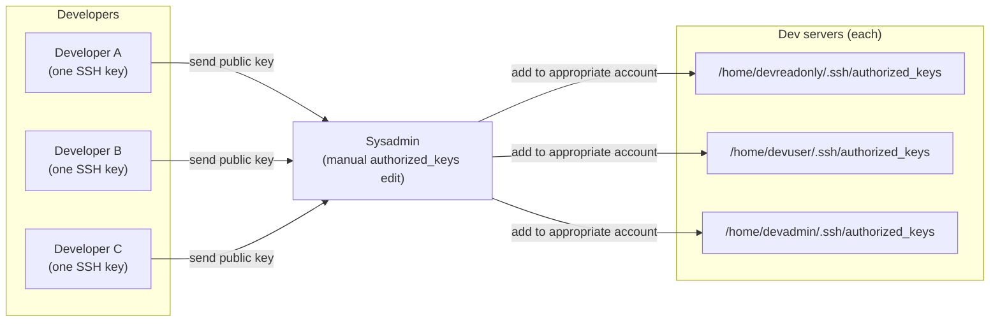
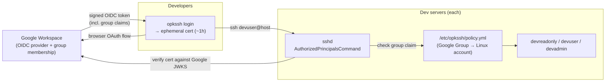

# Case study: replacing SSH key management with OPKSSH tied to Google Workspace

> Internal hostnames, group names, and account names in this write-up are generalized. The architecture and decisions are real.

## Context

Our dev servers had three shared Linux accounts — `devreadonly`, `devuser`, and `devadmin` — representing tiers of access from read-only inspection through to full admin. Each developer had a single SSH key pair. When someone needed access, the sysadmin manually added their public key to the `authorized_keys` file of whichever shared account matched their role.

This worked at small team size. At any meaningful scale it accumulated the usual problems:

1. **Sysadmin bottleneck.** Every access grant and revocation required a ticket and someone with server access to manually edit an `authorized_keys` file. New developer joining? Wait for the sysadmin. Developer changing role from read-only to full developer? Same wait. Developer leaving? Depended on the offboarding checklist being followed.
2. **Offboarding gaps.** Removing access meant deleting the right line from `authorized_keys` on every server the developer had been given access to. Miss one and the key still worked. There was no central list of "this key is on these servers" — it was institutional knowledge and manual tracking.
3. **No expiry.** A static SSH key doesn't expire. A compromised or leaked key remained valid until someone explicitly removed it, and there was no mechanism to detect or enforce rotation.
4. **No audit trail.** Knowing who currently had which level of access required reading `authorized_keys` files across every server and matching public key fingerprints back to individuals. There was no centralised, queryable record.

The goal: tie access to our existing Google Workspace identity, eliminate the manual sysadmin step for granting and revoking access, and make the keys short-lived by default.

## What OPKSSH is

[OPKSSH](https://github.com/openpubkey/opkssh) is an implementation of the OpenPubKey protocol applied to SSH. Instead of a developer distributing a static public key to servers, they authenticate with an OIDC provider (Google, in our case), and OPKSSH produces a short-lived SSH certificate cryptographically bound to that identity. The certificate carries the user's email and group membership claims from the OIDC token. It expires when the token does — typically one hour.

The SSH server verifies the certificate against the OIDC provider's public keys and checks the identity's group claims against a local policy that maps groups to permitted Linux accounts. If both checks pass, the connection is allowed. No `authorized_keys` file involved.

## Before and after

### Before



Every access change — grant, revoke, or tier change — went through the sysadmin.

### After



Access is now: Google Group membership → permitted account on each server. Granting access is adding someone to a Google Group. Revoking it is removing them, or disabling their Google account entirely.

## Access tier design

The three shared Linux accounts were kept as-is — they were already a familiar model for the team and the sudo policy written around them was sound. The change was in what authorised a person to use each one.

| Linux account | Access level | Who gets it | Authorised by |
|---|---|---|---|
| `devreadonly` | Read-only — inspect logs, view running services, no write capability | All active developers and ops | `dev-readonly` Google Group |
| `devuser` | Developer — deploy, restart services, write to app directories | Active developers | `developers` Google Group |
| `devadmin` | Admin — full sudo, used for infra changes and incident response | Senior engineers and ops | `dev-admins` Google Group |

Google Group membership became the single source of truth. The policy file on each server expressed the mapping:

```yaml
# /etc/opkssh/policy.yml
users:
  devreadonly:
    principals:
      - group: dev-readonly@company.com
  devuser:
    principals:
      - group: developers@company.com
  devadmin:
    principals:
      - group: dev-admins@company.com
```

A developer's OIDC token carries their Google Group memberships as claims. OPKSSH validates those claims against this policy before permitting the login.

## sshd configuration

The server-side change was replacing `authorized_keys`-based auth with an `AuthorizedPrincipalsCommand` that calls the OPKSSH verifier:

```
# /etc/ssh/sshd_config (relevant additions)
AuthorizedPrincipalsCommand /usr/local/bin/opkssh verify --policy /etc/opkssh/policy.yml %u %k %t
AuthorizedPrincipalsCommandUser nobody
PubkeyAuthentication yes
PasswordAuthentication no
```

The verifier receives the target Linux username, the presented public key, and the key type. It checks that the key is a valid OPK-bound certificate signed by Google's JWKS, that the token hasn't expired, and that the identity's group claims satisfy the policy for the requested account.

## Migration approach

We ran both methods in parallel throughout the transition so no developer lost access mid-process.

1. **Audit existing access first.** Before touching anything, mapped every public key fingerprint in every `authorized_keys` file back to an individual. This produced the ground truth of who had access to what, and surfaced two keys that couldn't be attributed to any current team member.

2. **Set up Google Groups to mirror current access.** Created the three groups in Google Workspace and populated them to match the existing `authorized_keys` state — same people, same tiers. Confirmed the group membership was correct before proceeding.

3. **Install OPKSSH on servers.** Installed the binary, wrote `policy.yml`, added the `AuthorizedPrincipalsCommand` to `sshd_config`. At this point both the old key path and the new OPKSSH path were active simultaneously.

4. **Developer-by-developer rollout.** Each developer installed the OPKSSH client, ran `opkssh login --provider=google`, confirmed they could connect to the account they expected, then had their static key removed from `authorized_keys`. Done in small batches so any issues were isolated.

5. **Handle long-running sessions.** A few developers kept persistent tmux sessions that would outlive the one-hour cert. We documented re-running `opkssh login` to refresh and reconnect, and communicated this before removing old keys for those developers specifically.

6. **Final cleanup.** Once all developers were on OPKSSH, removed the remaining `authorized_keys` files and dropped `AuthorizedKeysFile` from `sshd_config` to prevent keys being added back. Removed the two unattributed keys surfaced in the audit without incident — neither had been used recently.

7. **Offboarding verification.** Suspended a test account in Google Workspace and confirmed that a freshly issued cert for that identity was rejected immediately at the OIDC validation step.

## Results

- **Access changes no longer require a sysadmin.** Adding or removing someone from a Google Group is done in the Workspace admin console by anyone with that permission — no server access required, no ticket queue.
- **Offboarding is one action.** Suspend or remove the Google account; the OIDC token can no longer be issued and the next connection attempt fails. The one-hour cert expiry is the outer bound on residual access after a suspension — no `authorized_keys` entries to hunt down.
- **Keys expire automatically.** The maximum credential lifetime is the token expiry. A leaked cert is self-revoking. The old model had no equivalent mechanism.
- **The audit surfaced orphaned keys.** The pre-migration fingerprint audit found two keys belonging to nobody current. Under the old model these would have continued to sit in `authorized_keys` indefinitely — OPKSSH makes that class of problem structurally impossible since access is tied to an active Google identity.
- **Onboarding is faster.** Add to the right Google Group; developer installs the OPKSSH client and runs `opkssh login`. No key exchange, no sysadmin involvement, no waiting.

## What I'd do differently

- **Do the key fingerprint audit before anything else.** We started configuring servers and then did the audit in parallel. The two orphaned keys we found created a small scramble to figure out whether they were safe to remove. Run the audit first, resolve any unknowns, then start the migration.
- **Communicate cert expiry upfront.** The first developer we migrated was surprised when an active SSH session dropped after an hour. We knew this was a property of OPKSSH but hadn't made it explicit in our internal documentation before starting. Now the setup guide leads with it.
- **Script the Google Group → access tier check.** During the parallel run period we had a few cases where someone's Google Group membership didn't match what was in `authorized_keys` (access had drifted over time without a clear record). A script that compares group membership to current `authorized_keys` state and flags discrepancies would have found these faster.
