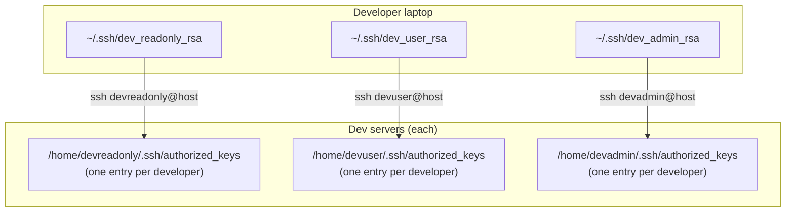
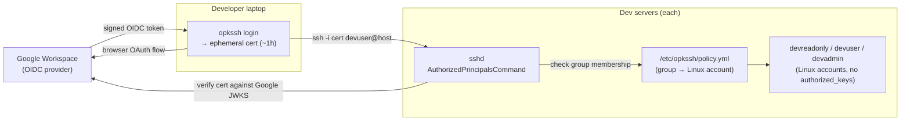

# Case study: replacing SSH key management with OPKSSH tied to Google Workspace

> Internal hostnames, group names, and account names in this write-up are generalized. The architecture and decisions are real.

## Context

Our dev team had a problem that most engineering teams eventually accumulate: a sprawling collection of SSH keys with no clean lifecycle. Each developer had separate key pairs for three tiers of access — read-only, developer, and admin — on the dev server fleet. Those keys lived in `authorized_keys` files on each server, added by hand during onboarding and, in practice, often not removed cleanly on offboarding.

The failure modes were predictable:

1. **Offboarding gaps.** When someone left, removing their keys meant manually editing `authorized_keys` on every server and every account tier. Forgetting even one left a credential that still worked indefinitely.
2. **No expiry.** A static SSH key doesn't expire. A compromised or leaked key remained valid until someone explicitly removed it.
3. **Key sprawl.** Developers were managing three key pairs (one per access tier), which meant key confusion, wrong-key-for-the-account errors, and support overhead when a developer rotated their laptop keys.
4. **Onboarding friction.** A new developer had to generate keys, share public keys with the right person, wait for them to be added to the right accounts on the right servers, and figure out which key to use for what.

The goal: tie dev server access to our existing Google Workspace identity, make keys ephemeral and automatically expiring, and eliminate the `authorized_keys` files entirely.

## What OPKSSH is

[OPKSSH](https://github.com/openpubkey/opkssh) is an implementation of the OpenPubKey protocol applied to SSH. Instead of distributing a static public key to servers, a developer authenticates with an OIDC provider (Google, in our case), and OPKSSH creates a short-lived SSH certificate cryptographically bound to that identity. The certificate contains the user's email and group membership claims from the OIDC token. It expires when the token does — typically one hour.

The SSH server verifies the certificate against the OIDC provider's public keys. If the signature is valid and the identity is in the access policy, the connection is allowed. No `authorized_keys` file involved.

## Before and after

### Before



Every server had three `authorized_keys` files. Every developer had three key pairs. Onboarding and offboarding touched every one of those files.

### After



Access is now: authenticate with Google → get a cert → cert carries group claims → policy maps groups to Linux accounts. Offboarding is: remove from Google Workspace or disable the account.

## Access tier design

We kept the three-tier Linux account model because it already matched what developers expected and the sudo policy was already written. The change was in what authorised access to each tier.

| Linux account | Access level | Who gets it | Authorised by |
|---|---|---|---|
| `devreadonly` | Read-only — can view logs, inspect running services, no write capability | All active developers and ops | `dev-readonly` Google Group |
| `devuser` | Developer — can deploy, restart services, write to app directories | Active developers | `developers` Google Group |
| `devadmin` | Admin — full sudo, used for infra changes and incident response | Senior engineers and ops | `dev-admins` Google Group |

Group membership in Google Workspace became the source of truth for which tier a person had access to. Adding someone to a group gave them access at that tier; removing them revoked it. The OPKSSH policy file on each server expressed this mapping:

```yaml
# /etc/opkssh/policy.yml
users:
  devreadonly:
    principals:
      - group: dev-readonly@company.com
  devuser:
    principals:
      - group: developers@company.com
  devadmin:
    principals:
      - group: dev-admins@company.com
```

The Google OIDC token carries group membership claims. The OPKSSH verification step on the server checks those claims against the policy before allowing the login.

## sshd configuration

The key change on each server was replacing `authorized_keys`-based auth with an `AuthorizedPrincipalsCommand` that calls the OPKSSH verifier:

```
# /etc/ssh/sshd_config (relevant additions)
AuthorizedPrincipalsCommand /usr/local/bin/opkssh verify --policy /etc/opkssh/policy.yml %u %k %t
AuthorizedPrincipalsCommandUser nobody
PubkeyAuthentication yes

# Disable password auth (was already off) and legacy key auth once migration complete
PasswordAuthentication no
```

The verifier (`opkssh verify`) is given the target Linux username, the presented public key, and the key type. It checks the key is a valid OPK-bound certificate, that it's signed by Google's JWKS, that the token hasn't expired, and that the identity's group membership satisfies the policy for the requested Linux account.

## Migration approach

We ran old and new access methods in parallel throughout the migration so no developer lost access mid-process.

1. **Set up Google Groups first.** Created the three groups (`dev-readonly`, `developers`, `dev-admins`) in Google Workspace and populated them to match current access before touching any server. Verified the groups were correct against the existing `authorized_keys` files.

2. **Install OPKSSH on servers.** Installed the OPKSSH binary and wrote the `policy.yml` on each server. Added the `AuthorizedPrincipalsCommand` to `sshd_config` alongside the existing `PubkeyAuthentication` (both pathways active).

3. **Developer-by-developer rollout.** Each developer installed the OPKSSH client, ran `opkssh login --provider=google`, confirmed they could connect via the new path, then got their static key removed from `authorized_keys`.

4. **Handle long-running sessions.** A few developers ran persistent tmux sessions that would outlive the one-hour cert. We documented using `opkssh login` to refresh the cert and reconnect, and made clear that the old static keys would be present until the individual was migrated.

5. **Final cleanup.** Once every developer was migrated and confirmed working, removed the remaining static `authorized_keys` files and removed `AuthorizedKeysFile` from `sshd_config` to prevent any keys being added back.

6. **Post-migration offboarding test.** Removed a test account from Google Workspace. Confirmed that a connection attempt with a freshly issued cert for that identity failed immediately (token validation failed at the OIDC step).

## Results

- **Offboarding is now one action.** Disable or remove the Google account; the next connection attempt with any cert for that identity fails. The one-hour cert expiry is the outer bound on access after a Google account is deprovisioned — no lingering `authorized_keys` entries to hunt down.
- **Onboarding is faster.** Add the person to the right Google Group, send them the OPKSSH client setup instructions (two commands). No key exchange, no waiting for someone to edit a file on a server.
- **Keys expire.** The maximum credential lifetime is the OIDC token expiry. A leaked or stolen cert is self-revoking. The old model had no equivalent.
- **Audit trail exists.** Google Workspace admin console shows current group membership and login history for the OIDC token issuances. Previously, there was no centralised record of who had access to what.
- **The three-tier model was preserved.** Developers kept the same accounts and the same mental model of access levels. The change was invisible to them except for the login flow.

## What I'd do differently

- **Get the group structure agreed before starting.** We had a minor back-and-forth about whether `devadmin` should be a third group or just a promotion within the developer group. Sorting that out mid-migration while the policy file was already on servers added unnecessary confusion. Lock the group taxonomy first.
- **Communicate the cert expiry implications earlier.** The first developer we migrated was surprised when their SSH connection dropped after an hour because the cert expired mid-session. We'd understood this as a property of OPKSSH, but hadn't explained it clearly to the team. Now onboarding docs include an explicit section on "your cert lasts one hour — run `opkssh login` to get a fresh one."
- **Script the `authorized_keys` audit.** We did the pre-migration comparison of `authorized_keys` entries to Google Group membership manually. A script that cross-references both and flags discrepancies (keys present with no matching Google account, accounts in Workspace with no key on servers) would have been faster and found one orphaned key we'd missed.
