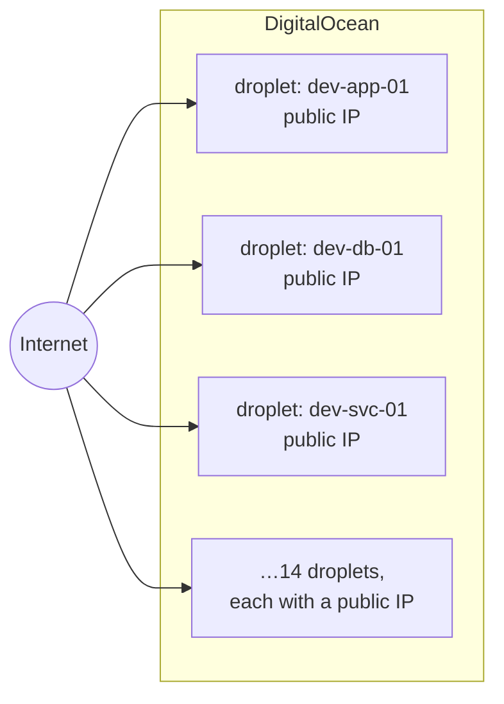
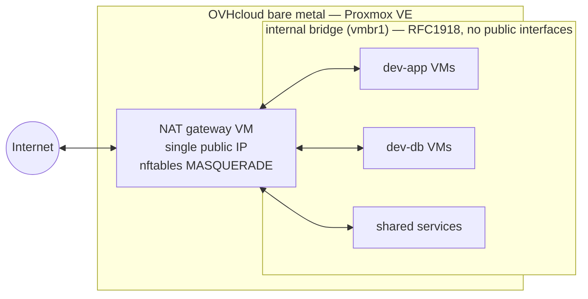

# Case study: migrating 14 cloud droplets to bare metal behind a NAT gateway

> Network ranges, hostnames, and service names in this write-up are generalized. The architecture and decisions are real.

## Context

Our development environments ran on 14 DigitalOcean droplets. Two problems had been building for a while:

1. **Cost.** Each droplet billed independently, and the fleet's combined monthly spend was significant for what were, functionally, internal dev environments.
2. **Attack surface.** Every droplet had its own public IP. Dev environments don't need to be internet-facing, but on droplets that's the default posture — which meant 14 publicly addressable machines that each needed individual firewall hygiene, patching urgency, and monitoring as if they were production.

The goal: move the fleet onto hardware we control, remove every public interface from the dev VMs, and keep the environments just as accessible to the team as they were before.

## Target architecture

A single OVHcloud bare-metal server running Proxmox VE, with all dev VMs on an internal bridge behind a NAT gateway. One public IP on the gateway; nothing else internet-addressable.

### Before

### After

## Network design

- **Two bridges on the Proxmox host.** `vmbr0` carries the public interface and connects only to the gateway VM. `vmbr1` is the internal bridge — every dev VM attaches here with an RFC1918 address and no route to the internet except through the gateway.
- **The gateway VM** is a minimal Linux VM with two NICs (one on each bridge). Outbound traffic from the internal network is masqueraded via nftables. Inbound access is deliberately narrow: SSH to the gateway, then onward to internal hosts — no direct port-forwards to dev VMs by default.
- **Team access** works the same as before from the developers' perspective: they reach the environments through the gateway, and internal DNS resolves the same service names they were already using.
- **Egress control** became possible for free: since all outbound traffic passes one chokepoint, logging and restricting what dev environments can reach externally is now a single config file instead of 14.

## Migration approach

1. **Inventory.** Catalogued all 14 droplets: what runs on each and what talks to what.
2. **Full disk images over SSH.** Each droplet's disk was copied in full over SSH and brought up as a Proxmox VM, so services, data, and state carried across intact instead of being rebuilt.
3. **Reconfigure for bare metal.** Ansible remediated each imported VM for its new home:
   - **DigitalOcean artifacts removed.** `droplet-agent` and `do-agent` uninstalled, DigitalOcean apt repositories dropped, and cloud-init's DigitalOcean datasource disabled, so VMs stopped querying the `169.254.169.254` metadata service and overwriting network and hostname settings at boot.
   - **Networking and DNS.** Each droplet's public-IP interface config (netplan or `/etc/network/interfaces`) replaced with an RFC1918 address on `vmbr1` and a default route via the NAT gateway VM. Resolvers pointed at internal DNS instead of DigitalOcean's. Hostnames and `/etc/hosts` entries referencing the old public IPs fixed, along with application configs that had public IPs or droplet hostnames hard-coded.
   - **Proxmox fit.** `qemu-guest-agent` installed and enabled so Proxmox can see guest IPs and run clean shutdowns and snapshots. `fstab` and GRUB entries fixed for the new disk devices. Guest NIC MTU set to 1400 to work around a Path MTU Discovery blackhole on OVHcloud's routed path, where full-size frames were silently dropped.
4. **Parallel run.** New environments came up on the internal network and were validated by the team while the droplets still existed. Nothing was destroyed until its replacement was confirmed working.
5. **Cutover and decommission.** DNS and team access flipped to the new environments; droplets were snapshotted, then destroyed in stages over the following weeks.

## Results

- **About $18,000 CAD a year saved**, net of the bare-metal lease. The lease is a flat cost well below the droplet fleet's combined bill, with substantially better hardware.
- **Attack surface reduced from 14 public IPs to 1.** Dev VMs are no longer internet-addressable at all.
- **Better hardware for the money.** Dedicated CPU and NVMe storage noticeably improved environment performance compared to shared-vCPU droplets.
- **Snapshot/restore via Proxmox** gave us environment-level backups that were previously per-droplet and ad hoc.

## What I'd do differently

- Start the inventory earlier. A couple of "nobody remembers what this droplet does" discoveries cost days.
- Set up the internal DNS zone before moving the first VM, not midway through. Early environments were reached by IP, which created temporary config drift that had to be cleaned up later.
