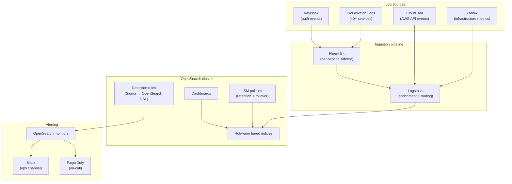

# Case study: building an OpenSearch SIEM for a HIPAA-regulated SaaS

> Service names, index patterns, and internal pipeline names in this write-up are generalized. The architecture and decisions are real.

## Context

We needed a SIEM. The regulatory context — HIPAA with FedRAMP in scope — meant that "we'll look at logs when something breaks" wasn't going to cut it for auditors or for us. Existing observability was scattered: application logs in CloudWatch, auth events in Keycloak, infrastructure metrics in Zabbix, and no single place to correlate across them.

The constraints that shaped the design:

1. **Data residency.** Logs containing PHI-adjacent metadata couldn't leave the AWS account in transit to a third-party SIEM. Managed SaaS SIEM options were off the table without significant legal review; running our own gave us a clean answer.
2. **Cost at scale.** 40+ services generating continuous log volume. Commercial SIEM licensing on per-GB ingestion pricing gets expensive fast at that scale.
3. **Detection coverage we could own.** We needed to write and tune our own detections, not work around a vendor's fixed rule taxonomy.

OpenSearch (self-managed on AWS) hit all three: data stays in the account, cost is infrastructure not ingestion fees, and detections are Sigma rules we maintain ourselves.

## Target architecture

## Design decisions

### Ingestion: Fluent Bit sidecars + Logstash

Fluent Bit runs as a sidecar on every ECS task, tailing container stdout and shipping to a central Logstash cluster. Logstash handles:

- **Field normalization.** Every source uses different timestamp formats, severity vocabulary, and field names. Logstash pipelines normalize to a shared schema before indexing.
- **Enrichment.** IP geolocation, EC2 instance metadata, and Keycloak realm context are added at ingest time rather than query time — much cheaper to do once on write.
- **Routing.** Different log types go to different index patterns with different retention policies. Auth events are kept longer than debug logs.

CloudTrail goes directly through Logstash — no Fluent Bit involved — since it's delivered to S3 and pulled on a schedule rather than streamed.

### Index strategy and retention

ISM (Index State Management) policies handle the full lifecycle:

- **Hot (7 days):** SSD-backed, full indexing, low query latency. Active alert correlation happens here.
- **Warm (30 days):** Slower storage, compressed, available for investigation and compliance queries.
- **Snapshot to S3 (1 year):** HIPAA requires audit log retention. Snapshots hit S3 with server-side encryption and are outside the cluster's compute cost.

Index templates enforce field mappings so detections don't break when a new service starts emitting a field with an unexpected type.

### Detection: Sigma → OpenSearch DSL

Detections are written as Sigma rules and compiled to OpenSearch query DSL using `sigma-cli`. This keeps detections source-agnostic — the same rule can target a different backend if we ever change the stack — and lets us track them in git with normal PR review and history.

Alert monitors in OpenSearch run these queries on a schedule and trigger destinations (Slack for low-severity, PagerDuty for high) via webhook. Monitor configs are managed as code so there's no drift between what's documented and what's actually running.

Key detection categories in scope at launch:
- Keycloak: brute-force patterns, impossible travel, service account anomalies (see [keycloak-zabbix-monitoring](https://github.com/r-t-chan/keycloak-zabbix-monitoring) for the Sigma rules)
- CloudTrail: IAM privilege escalation paths, root account usage, unusual cross-region API calls
- Application: spike anomalies in error rates that don't correlate with deployment events

### Access control

OpenSearch fine-grained access control maps to roles:

- **Security team:** full read across all indices, can write/modify detection rules.
- **On-call engineers:** read access to all indices, no admin.
- **Developers:** read access to their own service's index pattern only — enough to debug, not enough to see other teams' application logs.

All access is authenticated through Keycloak OIDC, so user provisioning and deprovisioning is handled in one place.

## Build sequence

1. **Cluster sizing and topology.** Started with a 3-node cluster (1 dedicated master, 2 data nodes) — small enough to be cheap to iterate on, large enough to handle the projected ingest volume with room.
2. **Schema design before data.** Wrote the index templates and field mappings before connecting any sources. Changing a mapping after data is indexed means reindexing, which is expensive at volume.
3. **One source at a time.** Brought in sources in order of signal value: CloudTrail first (highest compliance value), then Keycloak auth events, then application logs. Each source got its Logstash pipeline, a test index, and a manual review before going to production indices.
4. **Detections before dashboards.** Wrote and tuned detections against real data before building dashboards. Dashboards built around detections that already fire are useful; dashboards built speculatively mostly aren't looked at.
5. **ISM and retention last.** Got the data model and detections stable, then locked in the retention policy. Changing retention is easy; changing the schema is not.

## Results

- **Single pane for cross-source correlation.** Auth anomalies, infrastructure events, and application errors can now be correlated in one query rather than pivoting across three systems.
- **Compliance queries answered in minutes, not days.** Auditor requests for "show us all authentication events for user X over the past 90 days" go from a manual process to a saved search.
- **Detection-as-code workflow.** Every new or modified detection goes through a PR with peer review. The audit trail for "when did we start detecting X" is just git log.
- **Cost well below commercial alternatives.** Infrastructure cost (EC2 + EBS + S3 for snapshots) is a fraction of what per-GB SIEM licensing would cost at this log volume.

## What I'd do differently

- **Schema governance earlier.** We had field name collisions between two services that both emitted a field called `user_id` with different semantics (one was an internal UUID, one was an external identifier). Resolving it mid-stream required a reindex and a Logstash pipeline fix. A schema registry or at least a documented field dictionary at the start would have prevented it.
- **Alert fatigue is real.** The initial detection set was too sensitive — noisy rules generated enough false positives that on-call started ignoring alerts. Tuning took longer than writing the rules. Build in time for a tuning sprint after initial rollout.
- **Document the ISM policies.** ISM policy JSON is not self-documenting. We had a moment where nobody was sure whether a particular policy was still active or superseded. Now the policy configs live in git alongside a short comment explaining what they govern and why the retention window is what it is.
